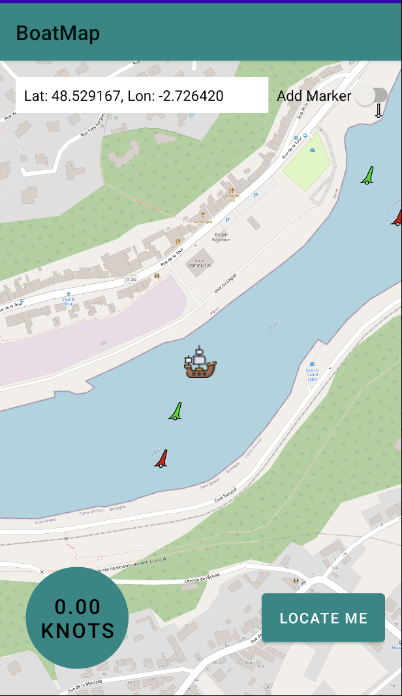
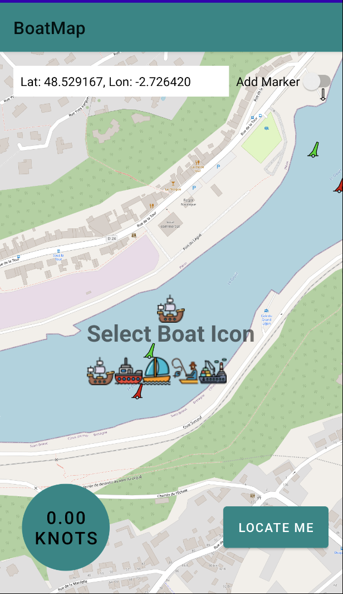

# BoatMap Android Application

## Project Overview

The BoatMap Android Application is a location-based Android app designed for boating enthusiasts. It allows users to view maps, track their location, and monitor their speed. The app supports both online and offline maps, giving users flexibility in navigation.

## Features

1. **Map Display**: The app uses the osmdroid library to display maps. It provides the option to switch between online and offline map sources.

2. **Location Tracking**: The application tracks the user's location using the device's GPS sensor and displays it on the map.

3. **Speed Monitoring**: Users can monitor their speed while boating. Speed can be displayed in knots or kilometers per hour, depending on the user's preference.

4. **Marker Placement**: The app allows users to place custom markers on the map, enabling them to mark specific points of interest.

5. **User Location Centering**: Users can easily center the map on their current location by tapping a button.

6. **Offline Maps**: Users can load offline maps using the popular MBTiles format, making navigation possible even without an internet connection.

## Usage

1. Launch the application on your Android device.

2. Grant location permissions when prompted to allow the app to access your GPS data.

3. The map will be displayed, and your location will be shown on the map.

4. Use the "Speed" button to toggle between displaying your speed in knots or kilometers per hour.

5. To center the map on your current location, click the "Locate Me" button.

6. Use the "Switch Map Source" toggle to switch between online and offline map sources.

7. To load an offline map, click on the "Load Offline Map" option and select an MBTiles file.

## Screenshots

## Technologies Used

- Java
- Android Studio
- osmdroid library

## Installation

To install the BoatMap Android Application, follow these steps:

1. Download the APK file from [GitHub Repository](link-to-your-github-repo).

2. Enable "Install from Unknown Sources" in your Android device's settings.

3. Install the downloaded APK.

4. Launch the application.

## Acknowledgments

This project was created as a part of [mention the context or organization] by [your name].

## License

This project is open-source and licensed under the [License Name]. For more details, see the [LICENSE.md](LICENSE) file.

## Contributing

Contributions are welcome. Feel free to [fork the repository](https://github.com/globecen/BoatMap/fork) and submit pull requests.
